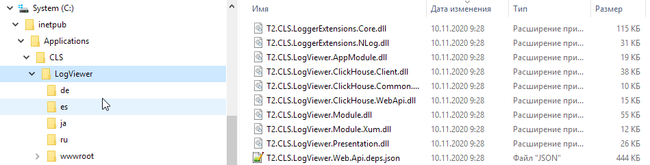
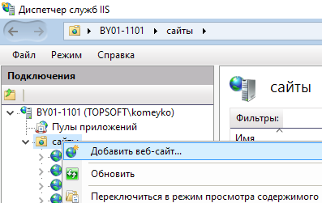
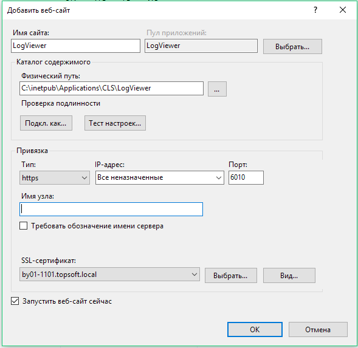
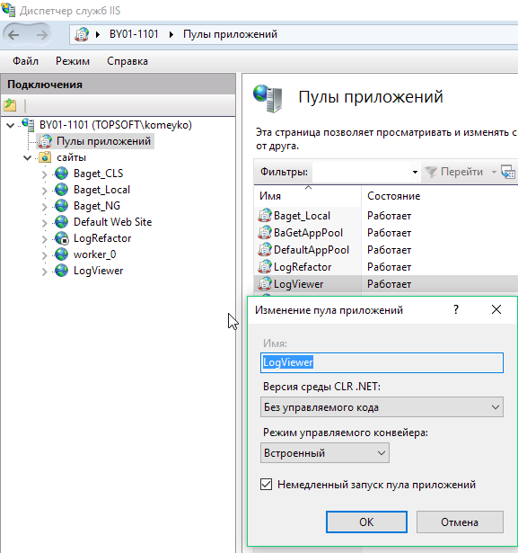
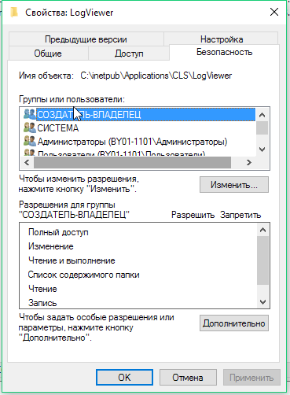
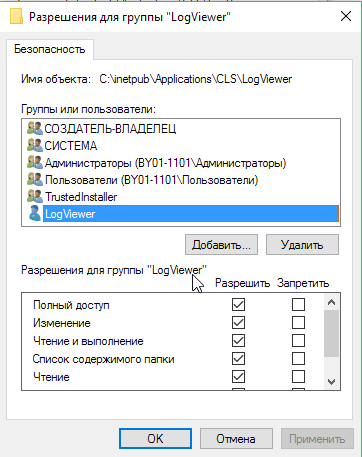
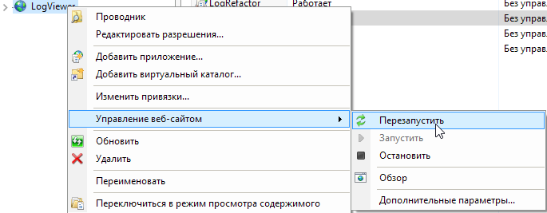
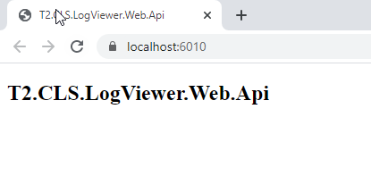

---

id: getting_started_deployment_logviewer_iis
title: Развёртывание интерфейса анализа логов на IIS
prev: false
next: false 

---

### Развёртывание  интерфейса анализа логов на IIS

Для развёртывания сервиса анализа логов необходимо получить архив ```T2.CLS.LogViewer.zip```.

В каталоге ```с:\\interpub\\``` создать подкоталог ```Applications\\CLS\\```.
В данном каталоге будут размещаться приложения для логирования. 

Создать каталог ```LogViewer```.

Скопировать в каталог содержимое архива.



Открыть **Диспетчер службы IIS**.

Выбрать узел *"сайты"*, открыть контекстное меню и выбрать пункт *Добавить веб-сайт*



Заполнить форму в соответствии со скриншотом ниже:



Для работы https требуется сертификат. 

В данном варианте пул приложении создаётся автоматически исходя из названия созданного сайта. 

Необходимо перейти в узел **Пулы приложений**.

Выбрать созданный пул  ```worker_0``` и вызвать контекстное меню. 

В контекстном меню выбрать пункт **Основные настройки**.

Установить настройки в соответствии со скриншотом ниже.



Далее требуется раздать права доступа на каталог приложения для учётной записи пула.

Для этого необходимо открыть свойства каталога и вкладку ```Безопасность```. 



Нажать кнопку ```Изменить...```, потом ```Добавить```.

В поле ```В следующем месте:``` необходимо выбрать текущую машину. (Если пул приложений будет привязан к другой учётной записи, то размещение и имя пользователя выбирать надо с указанием нужного домена и логина).

В поле имени объекта вводим ```iis apppool\LogViewer``` и нажимаем кнопку "Проверить имена".

Если имя найдено, то нажимаем ```Ok```.

Установить для пользователя полный доступ:



Для запуска приложения необходимо настроить права доступа в MSSQL для создания, изменения и чтения.

<font color="red">*\[необходимо добавить инструкцию для управления БД\]*</font>


Далее необходимо обязательно выполнить конфигурирование:
* [сервиса анализа логов](../../../configuration/common_settings/xumapi)
* единого клиента

<font color="red">*\[необходимо добавить ссылки на раздел конфигурирования\]*</font>

Перезапустить сайт в iis, для применения всех настроек.



Проверяем работу сервиса. Для этого в адресной строке браузера необходимо ввести url: ```https://localhost:6010```

Результатом будет следующее:




</br>
</br>

<font color="green">*\[Раздел будет дополнен\]*</font>


