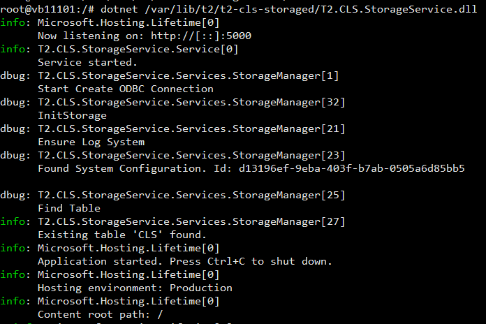

---

id: getting_started_deployment_storageService
title: Storage Service
prev: false
next: false

---

### Сервис управления хранилищем

Данный сервис устанавливается на одной машине с ClickHouse или так, что бы был доступ к файлам данных ClickHouse для отсоединения и присоединения партиций.

#### Подготовка

Необходимо создать пользователя, от имени которого будет работать служба:

	adduser t2-cls

Создать директорию и скопировать в неё содержимое архива ```T2.CLS.StorageService.zip```:

	mkdir /var/lib/t2/t2-cls-storaged/ -p

Назначить нового пользователя владельцем данной директории:

	cd /var/lib/t2
	chown -R t2-cls:t2-cls t2-cls-storaged

Т.к. служба занимается архивированием устаревших партиций, у неё должен быть доступ к директории данных **Clickhouse**, для этого необходимо добавить созданного пользователя в состав группы clickhouse

    usermod -aG clickhouse t2-cls

#### Конфигурация службы

В настройках службы (файл ```appsettings.json```) указать подключение к БД а также путь к директории данных Clickhouse и путь хранению архивов.
Ниже представлен стандартные параметры в секции настройки. 

    "Storage": {
        "HttpUrl": "http://localhost:8123/",
        "User": "default",
        "Password": "",
        "DataBase": "T2Logs",
        "DataPath": "/var/lib/clickhouse/data",
        "ArchivePath": "/var/lib/clickhouse/archive"
    }

Проверить, что служба запускается и работает:

	dotnet /var/lib/t2/t2-cls-storaged/T2.CLS.StorageService.dll
	
Результатом будет следующее: 



Для остановки сервиса необходимо нажать ```ctrl+C```.

#### Создание демона

В директории ```/usr/lib/systemd/system``` создать конфигурационный файл службы ```t2-cls-storaged.service``` и открыть на редактирование.
	
	sudo touch /usr/lib/systemd/system/t2-cls-storaged.service
	sudo nano /usr/lib/systemd/system/t2-cls-storaged.service
	
В файле ```t2-cls-storaged.service``` добавить строки содержимым:

    [Unit]  
    Description=T2 CLS Storage Service  
      
    [Service]  
    ExecStart=dotnet /var/lib/t2/t2-cls-storaged/T2.CLS.StorageService.dll
    WorkingDirectory=/var/lib/t2/t2-cls-storaged
    User=t2-cls  
    Group=t2-cls
    Restart=on-failure  
    SyslogIdentifier=t2-cls-storaged 
    PrivateTmp=true  
      
    [Install]  
    WantedBy=multi-user.target

Перезагрузить конфигурацию служб и создать метассылку для нашей службы:

    systemctl daemon-reload  
    systemctl enable t2-cls-storaged

Запустить службу и проверить её статус:

    systemctl start t2-cls-storaged
    systemctl status t2-cls-storaged
