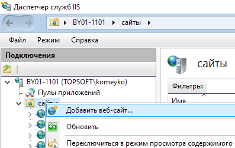
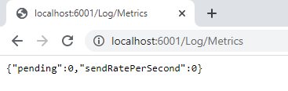

---

id: getting_started_deployment_transport_iis
title: Развёртывание транспорта на IIS
prev: false
next: false 

---

### Развёртывание транспорта на IIS

Для развёртывания транспорта необходимо получить архив ```T2.CLS.LogTransport.zip```.

В каталоге ```с:\\interpub\\``` создать подкоталог ```Applications\\CLS\\```.
В данном каталоге будут размещаться приложения для логирования. 

Создать каталог ```worker_0```.

Скопировать в каталог содержимое архива.


Открыть **Диспетчер службы IIS**.

Выбрать узел *"сайты"*, открыть контекстное меню и выбрать пункт *Добавить веб-сайт*



Заполнить форму в соответствии со скриншотом ниже:


В данном варианте пул приложении создаётся автоматически исходя из названия созданного сайта. 

Необходимо перейти в узел **Пулы приложений**.

Выбрать созданный пул  ```worker_0``` и вызвать контекстное меню. 

В контекстном меню выбрать пункт **Основные настройки**.

Установить настройки в соответствии со скриншотом ниже.


Далее требуется раздать права доступа на каталог приложения для учётной записи пула.

Для этого необходимо открыть свойства каталога и вкладку ```Безопасность```. 


Нажать кнопку ```Изменить...```, потом ```Добавить```.

В поле ```В следующем месте:``` необходимо выбрать текущую машину. (Если пул приложений будет привязан к другой учётной записи, то размещение и имя пользователя выбирать надо с указанием нужного домена и логина).

В поле имени объекта вводим ```iis apppool\worker_0``` и нажимаем кнопку "Проверить имена".

Если имя найдено, то нажимаем ```Ok```.


Установить для пользователя полный доступ:


Перезапустить сайт в iis, для применения всех настроек.


Проверяем работу сервиса. Для этого в адресной строке браузера необходимо ввести url: ```http://localhost:6001/Log/Metrics```

Результатом будет следующее:


