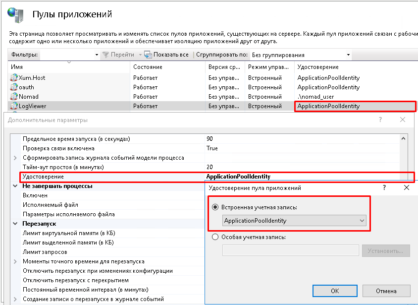
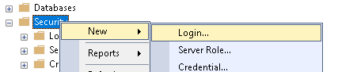
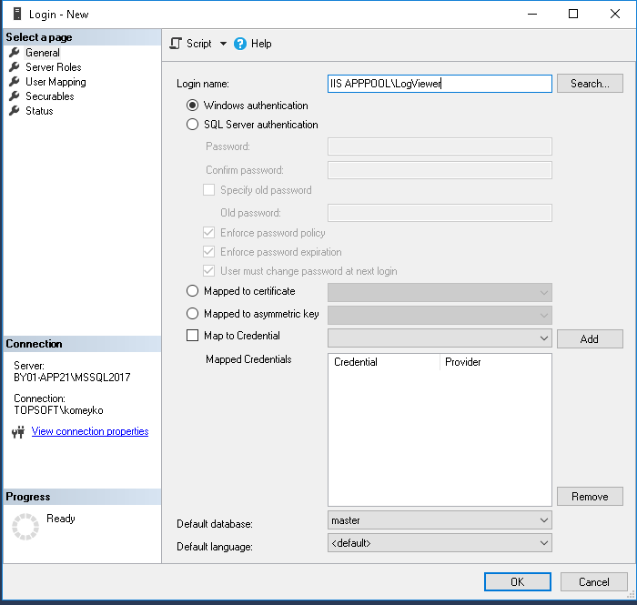
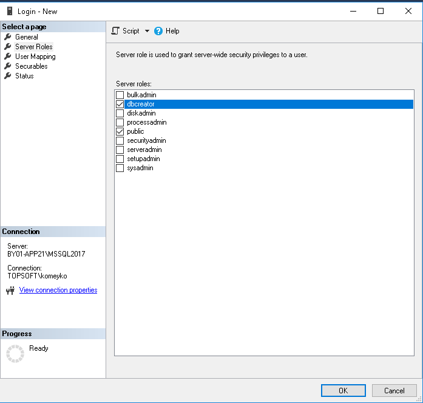

---

id: knowledge_base_mssql_add_service_user
title: Добавление пользователя в MSSQL для работы XUM
next: false
prev: false

---

### Определение учётной записи

Для работы Xum пользователю, под которым запускается сервис необходим доступ на создание базы данных, создание и изменение схемы.

#### IIS 

При запуске сервиса в IIS приложение запускается в "**пуле приложений**".

Пул приложений может работать со следующими удостоверениями: 

- **Встроенная учётная запись** - предопределённый список системных учётных записей (**ApplicationPoolIdentity**,  LocalService, LocalSystem, NetworkService). По умолчанию используется удостоверение **ApplicationPoolIdentity**. Учётная запись будет следующего формата: 

  ::: tip Пример

  IIS APPPOOL\LogViewer

  :::

- **Особая учётная запись** - отдельная локальная или доменная учётная запись. 
  ::: tip Пример 

  *TOPSOFT\LogViewerService*

  :::

  

### Настройка в MS SQL

Для настройки пользователя необходимо подключиться к серверу.

Правой кнопкой мыши по узлу **Security** и выбрать **New**->**Login**

Ввести логин:

Установить серверную роль **dbcreator**

Ok.